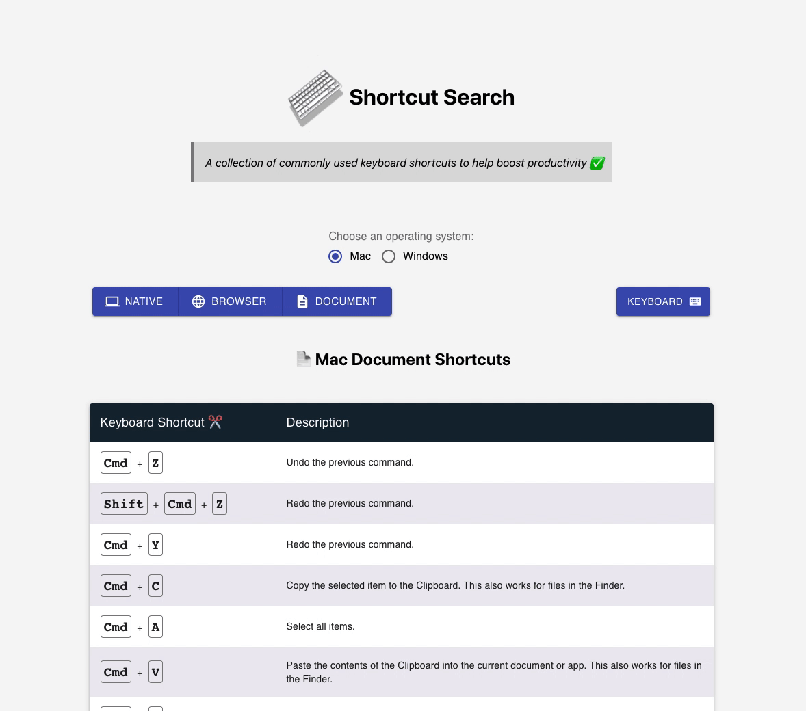

#  Keyboard Shortcut Search 🔍

<!-- PROJECT LOGO -->
 

  

  

  <strong>A collection of commonly used keyboard shortcuts to help boost productivity ✅ </strong>
     
     
    <a href="https://keyboard-shortcut-search.vercel.app/">View Demo 🏗️</a>
  

<!-- ABOUT THE PROJECT -->
## How it Works ✨
-  **Step 1**: Choose an operating system (Mac or Windows)
-  **Step 2**: Select a Category
      1. **Native** - Shortcuts to use within the operating systems ecosystem.
      2. **Browser** - Shortcuts to use across browsers like Chrome and Firefox.
      3. **Document** - Shortcuts to use when working with text. (i.e. Word documents, emails, Slack messages, etc.)
- **Step 3:** Decide on a View
     1. **Table View** -  Presents all the shortcuts available in a tabular form. This is filtered based on the selected category and operating system.
     2. **Keyboard View** - Interactive area where you can press any key (max of 4) to dynamically search for a shortcut. This is a filtered search based on the selected category and operating system.

### Built With 🛠️
* [React](https://reactjs.org/) (Bootstrapped with [Create React App](https://create-react-app.dev/))
* [Material-UI](https://material-ui.com/)

<!-- CONTRIBUTING -->
## Contributing
If there are additional shortcuts you want to add, you can do so via the [windowsShortcuts.js](https://github.com/Cool-Runningz/keyboard-shortcut-search/blob/main/src/data/windowsShortcuts.js) and/or
 [macShortcuts.js](https://github.com/Cool-Runningz/keyboard-shortcut-search/blob/main/src/data/macShortcuts.js) data files. 
1. Fork the Project
2. Create your Feature Branch (`git checkout -b feature/AmazingFeature`)
3. Commit your Changes (`git commit -m 'Add some AmazingFeature'`)
4. Push to the Branch (`git push origin feature/AmazingFeature`)
5. Open a Pull Request

<!-- LICENSE -->
## License 

Distributed under the MIT License. See `LICENSE` for more information.

<!-- CONTACT -->
## Contact

Alyssa Holland - [@Code_Runnings](https://twitter.com/your_username) - HeyAHolland@gmail.com

Project Link: [https://github.com/Cool-Runningz/keyboard-shortcut-search](https://github.com/Cool-Runningz/keyboard-shortcut-search)